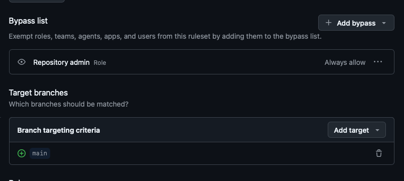

Personal repository for module 4 activities.
For the repository governance:

- I added Tania Alcantara as collaborator, collaborators are allowed to interact with repository branches and create Pull Request.
- For access level for the repository I enabled a rule where newly created accounts cannot access to this repository after one week.
- For changes in main branch a Pull Request is needed, and this PR should be approved by owner (me)
- A Secret Access Key Value and a Secret Variable were added to this repository. Fake values were added.

A Ruleset I added is to protect main branch by forcing each PR has at least 1 approval from collaborators to be able to merge to main.
Only admin can bypass this rule.
