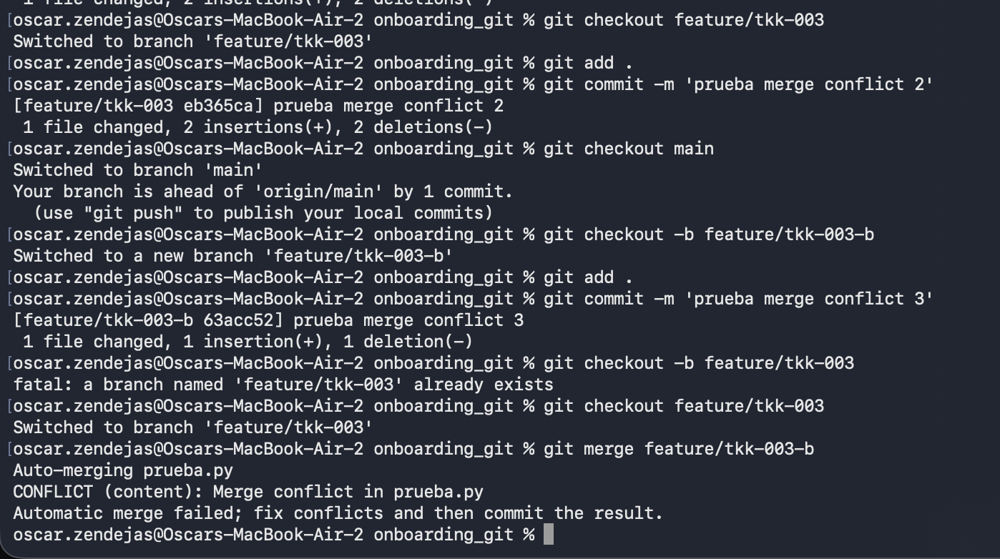
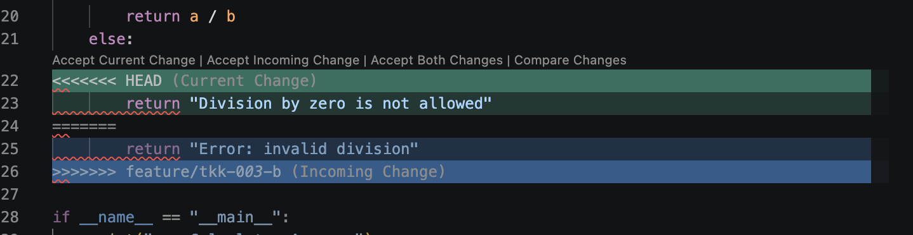
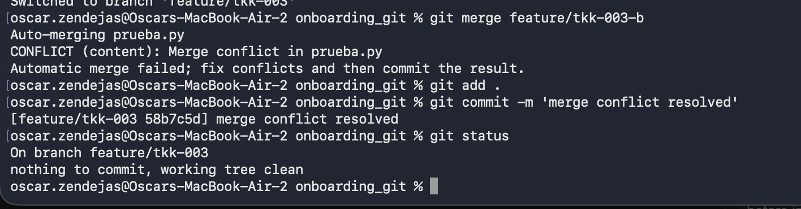

A wild Merge conflict appears!

To solve this merge conflict in this case we accept the current change, since both branches modified the same file we only click on Accept Current Change to keep the oldest version (in this case), so far there can be the newest change but in order to solve this test I decided to chose the oldest one.

